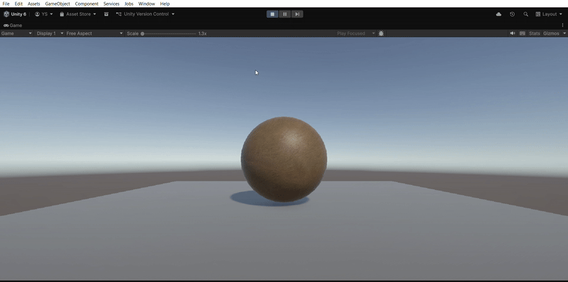

# Unity: Interactive Shader Study

A study project for Technical Artist portfolio focused on visual feedback and interaction in Unity 6.2.

## 🎯 Features
* **Interactive Hover:** Dynamic material switching upon mouse hover.
* **Raycasting:** Implemented object detection using modern Raycast logic.
* **New Input System:** Integrated mouse position tracking via the modern Unity Input System API.

## 🛠 Technical Stack
* **Engine:** Unity 6.2
* **Art:** Custom Shaders & Materials
* **Scripting:** C# (Event-driven feedback)

## 📺 Demo

